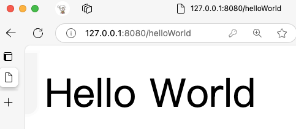
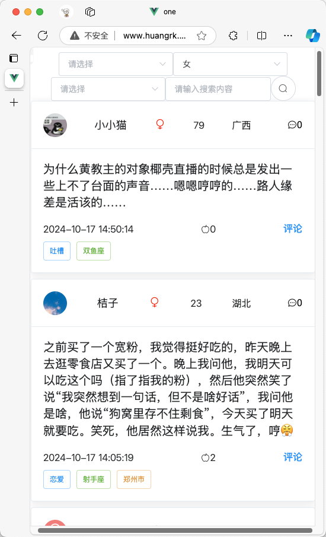

## 后端

1. 整合SpringBoot3.2.0 和SpringSecurity
2. 启动项目访问http://127.0.0.1:8080,会自动重定向到登陆界面
3. 输入账号test密码123456
4. 访问http://127.0.0.1:8080/helloWorld
5. 返回Hello World字符串

## ML data

从目标数据集中提取出问题和回答, 使用**正则表达式**进行数据提取. 

## 爬虫

爬取一罐APP中的帖子信息, 并保存到数据库中, 编写前后端代码对数据进行展示, 并提供一定的条件查询能力.

